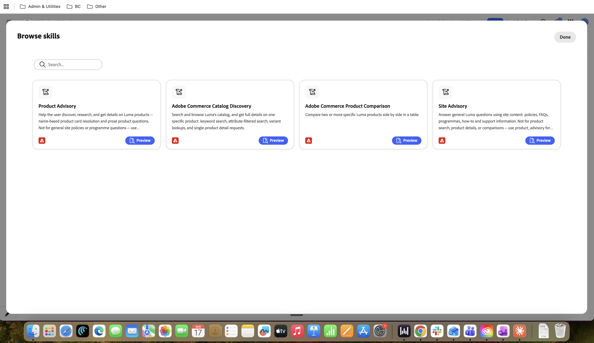

# Skills and Integrations Framework {#skills-and-integrations}

Eine Integration (früher als Tool bezeichnet) ist eine Verbindung zu einer Datenquelle oder einem Backend. Eine Fähigkeit ist ein Verhalten.

Eine Integration kann von vielen Fähigkeiten verwendet werden. Eine Qualifikation kann mehrere Integrationen verwenden. Sie können sie unabhängig konfigurieren und gemeinsam zuordnen.

## Skills

Eine Fertigkeit ist die Verhaltensebene eines Concierges. Es ist eine benannte, wiederverwendbare Einheit, die eine einzige Aufgabe definiert, die der Concierge tun kann: was er tut, wann er eintritt und wie er reagiert. Eine Qualifikation enthält keine eigenen Daten, sondern leiht sich Funktionen aus den mit ihr verbundenen Integrationen aus.

Jede Fertigkeit besteht aus fünf Teilen:

| Teil | Was es ist |
| --- | --- |
| Name | Die Kennung der Qualifikation |
| Beschreibung | Wozu die Qualifikation dient, ihr Zweck im Klartext |
| Verwenden Sie wenn | Die Bedingung des Triggers. Dies ist das Routing-Signal, das dem Concierge mitteilt, wann diese Fähigkeit aufgerufen werden soll und nicht eine andere |
| Integrationen | Die spezifischen Tools, die diese Qualifikation aufrufen darf, um ihre Aufgabe zu erfüllen. Eine Qualifikation kann nur verwenden, was hier angehängt ist |
| Anweisungsdatei | Die detaillierten Anweisungen, die steuern, wie sich die Kenntnisse verhalten und wie sie eine Anfrage interpretieren, ihre Antwort formatieren und ihre Leitplanken anwenden |

Verhalten einer Qualifikation zur Laufzeit: Wenn eine Benutzernachricht eingeht, gleicht die Plattform diese mit dem „Verwenden Wenn“-Trigger jeder aktiven Qualifikation ab und leitet die Nachricht an die entsprechende Qualifikation weiter. Diese Fähigkeit führt dann ihre Anweisungen aus und ruft nur die mit ihr verbundenen Integrationen auf. Seine Anweisungen sind in das allgemeine Laufzeitverhalten des Concierge neben dem Markenprofil und anderen aktiven Fähigkeiten zusammengefasst.

Eine Fähigkeit entscheidet, was zu tun ist und wann. Es stellt selbst keine Verbindung zu Daten her. Dies ist die Rolle der Integration.

_Beispiel für die Site Advisory-Fähigkeit_

{width="800" zoomable="yes"}

## Integrationen

Eine Integration ist die Fähigkeitsebene eines Concierges. Es handelt sich dabei um eine Verbindung zu einem externen oder Backend-System (einer Wissensdatenbank, einer Inhaltsquelle, einem Live Commerce-Katalog), das Daten abruft oder eine Aktion ausführt. Wo eine Fähigkeit ein Urteilsvermögen ist, ist eine Integrationsfähigkeit.

Jede Integration weist die folgenden Merkmale auf:

| Kennlinie | Bedeutung |
| --- | --- |
| Verbindung und Anmeldedaten | Eine Integration authentifiziert sich über ihre eigene Konfiguration für ihr Backend, z. B. eine Commerce-Umgebungs-ID und einen API-Schlüssel. Diese Konfiguration verweist auf die richtige Datenquelle |
| Verfügbare Funktionen | Durch eine Integration werden eine oder mehrere aufrufbare Funktionen verfügbar, d. h. die einzelnen Aktionen, die eine Qualifikation aufrufen kann. Commerce MCP stellt beispielsweise die Produktsuche, Produktdetails, Varianten und die Facettenerkennung als separate Funktionen bereit |
| wiederverwendbar | Eine Integration kann an viele Fähigkeiten angehängt werden, und die gleiche Integration dient vielen Concierges und Kunden. Diese Wiederverwendung ist die Kerneffizienz des Frameworks |

Verhalten einer Integration zur Laufzeit: Wenn eine Qualifikation ausgelöst wird und entscheidet, dass Daten benötigt werden, wird eines der Tools der Integration aufgerufen. Die Integration führt diesen Aufruf für das Live-Backend aus und gibt der Qualifikation strukturierte Daten zurück, die die Qualifikation dann verwendet, um ihre Antwort zu bilden.

Eine Integration bietet Fähigkeiten, übt aber kein Urteilsvermögen aus. Es wartet darauf, von einer Qualifikation aufgerufen zu werden, erledigt die angeforderte Aufgabe und gibt das Ergebnis zurück.

### Funktionen und Einschränkungen (die Self-Service-Grenze)

- **Self-Service, kein Engineering:** Bearbeiten Sie Anweisungen, bearbeiten Sie Trigger, die bei Bedarf verwendet werden, fügen Sie vorhandene Integrationen an oder trennen Sie sie, aktivieren oder deaktivieren Sie eine Kenntnisse und verbinden Sie eine unterstützte Integration (wie Commerce MCP mit gültigen Anmeldeinformationen).

- **Nicht zur Selbstbedienung, erfordert Engineering:** Erstellen Sie ein brandneues Tool oder einen Connector, das bzw. der noch nicht im Katalog vorhanden ist, fügen Sie eine neue Leitplankenkategorie hinzu, die das Framework nicht unterstützt, oder ändern Sie, welche Daten ein Backend verfügbar macht.

- **Die Überschneidung von Triggern zwischen zwei Qualifikationen ist ein Konfigurationsrisiko:** Wenn zwei Qualifikationen plausibel für dieselbe Nachricht ausgelöst werden können, kann das Routing inkonsistent sein. Schreiben Sie Trigger, um echte Unklarheiten zu vermeiden, anstatt sich darauf zu verlassen, dass der Router sie löst.

## Vorkonfigurierte Integrationen

Im Folgenden finden Sie die vier Integrationen, die im Bedienfeld **Durchsuchen-Integrationen“** Composer angezeigt werden.

| Integration | Funktion | Anmerkungen |
| --- | --- | --- |
| Wissensdatenbanksuche | Source für Produktinformationen, Preise, Funktionen und Dokumentation einer Marke, die über Site crawlen ausgefüllt werden | Diese wird automatisch bei der Erstellung durch den Concierge erstellt und von der crawlen Site ausgefüllt |
| Content-KI-Suchen | Durchsucht den Markeninhalt über die Content-KI | Eine alternative Inhaltsquelle. Normalerweise ist jeweils nur eine der KI-Suchen „Wissensdatenbanksuche“ oder „Inhaltssuche“ erforderlich |
| Entitätsverknüpfung/Produktkatalogzuordnung | Löst ein Produkt oder Markenerwähnung in einer Benutzernachricht zu bestimmten Katalogentitäten auf | Unterstützende Integration, die zusammen mit einer Suchintegration statt allein verwendet wird |
| COMMERCE MCP | Adobe-verwalteter Commerce MCP-Server: Produktsuche, Details, Varianten und Facetten-/Attributerkennung, unterstützt durch Adobe Live Search | Nicht in der Baseline; für Commerce-Anwendungsfälle manuell hinzugefügt |

{width="800" zoomable="yes"}

## Vorkonfigurierte Kenntnisse

Im Katalog sind vier Qualifikationen enthalten. Es werden jeweils die empfohlenen Integrationen aufgelistet.

| SKILL | Wofür es gut ist | Recommended integrations |
| --- | --- | --- |
| Site-Beratung | Allgemeine Fragen zur Marke: Richtlinien, FAQs, Programme, Anleitungen und Support | Knowledge Base-Suche, Inhaltsdaten und Entitäts-KI-Suche |
| Produktberatung | Produkte entdecken und recherchieren: Namensbasierte Produktkarten und Prosaproduktfragen | Wissensdatenbanksuche, Entitätsverknüpfung/Katalogzuordnung |
| Adobe Commerce-Katalogerkennung | Durchsuchen, Filtern und Abrufen vollständiger Details zu Produkten in einem Live-Katalog | Commerce MCP-Tools: Suchen nach Commerce-Produkten, Produktdetails, Produktvarianten, Produktfacetten und durchsuchbaren Attributen |
| Adobe Commerce - Produktvergleich | Vergleich von zwei oder mehr benannten Produkten in einer Tabelle für Commerce | Commerce MCP-Tools: Commerce-Produkte durchsuchen, Produktdetails |

Die beiden Commerce-Kenntnisse sind Funktionen, die nur für den Katalog verfügbar sind, und hängen von der Commerce MCP-Integration ab, die nicht Teil der Grundlinie ist. In einem nicht-kommerziellen Concierge führen Site Advisory und Product Advisory stattdessen die automatisch erstellte Knowledge Base Search durch.

{width="800" zoomable="yes"}

## Was bei der Concierge-Einrichtung verdrahtet wird

Wenn ein Concierge per One-Click-Setup erstellt wird, wird die Grundlinie für Sie zusammengestellt.

| Bei Erstellung vernetzt | Detail |
| --- | --- |
| Wissensdatenbank (Daten) | Der frühe crawlen bildet eine Wissensdatenbank aus den zehn bis 15 Top-Seiten der Website, die über die Sitemap gefunden wurden. Dies ist der Inhaltsspeicher, keine Kenntnisse oder Integration |
| Wissensdatenbanksuche (Integration) | Integrierte Integration, die mit der crawlen Wissensdatenbank verbunden ist und für die Suche verwendet wird. Der crawlen erzeugt dies nicht, er verweist auf das, was der crawlen erzeugt hat |
| Site-Beratung (Kenntnisse) | Aktiv in der Baseline, verkabelt, um die Wissensdatenbanksuche aufzurufen, die die crawlen Wissensdatenbank abfragt |

## Häufig gestellte Fragen

**Was ist der Unterschied zwischen einer Qualifikation und einer Integration?**

Eine Integration ist eine Verbindung zu einer Datenquelle oder einem Backend. Hierfür kann sich der Concierge entscheiden, z. B. eine Wissensdatenbank oder einen Live Commerce-Katalog. Eine Fertigkeit ist ein Verhalten; sie entscheidet, was der Concierge tut, wann er es tut und welche Integrationen er benutzen darf.

**Faustregel:** Eine Integration ist eine Fähigkeit; eine Fähigkeit ist das Urteil darüber, wann und wie diese Fähigkeit verwendet wird.

**Kann dieselbe Integration von mehr als einer Qualifikation verwendet werden?**

Ja, und das ist Absicht. Die Tools von Commerce MCP werden sowohl für die Katalogerkennung als auch für den Produktvergleich verwendet. Das einmalige Erstellen einer Integration und deren Wiederverwendung über viele Fähigkeiten und viele Kunden hinweg ist die Kerneffizienz des 2.0-Frameworks; dadurch wird der benutzerdefinierte Build pro Kunde entfernt.

**Kann ein Anwender eine völlig neue Funktion ohne Engineering hinzufügen?**

Nur wenn im Katalog bereits eine Integration dafür vorhanden ist. Ein Anwender kann jede vorhandene Integration frei zuordnen, konfigurieren und anweisen; das ist Self-Service. Wenn für die Funktion jedoch ein Backend oder ein Connector erforderlich ist, der noch nicht vorhanden ist (eine neue API oder ein neuer Datenquellentyp), ist dies eine Engineering-Aufgabe, um die Integration zuerst zu erstellen. Sobald es im Katalog vorhanden ist, wird die Konfiguration wieder zur Selbstbedienung.

**Wie unterscheidet sich dies von der einzigen Systemaufforderung von BC 1.0?**

In Version 1.0 wurde das Verhalten durch eine große Systemaufforderung (das Manifest) gesteuert, die schwer sicher zu bearbeiten war und im Allgemeinen Änderungen durch Engineering erforderte. In 2.0 gibt es das Manifest noch, aber es besteht aus modularen Teilen, anstatt als ein Block geschrieben zu werden. Das macht das Verhalten von einem Praktizierenden konfigurierbar und macht individuelle Leitplanken und Anweisungen lesbar und überprüfbar anstatt in einer Eingabeaufforderung begraben zu sein.

**Was genau erzeugt der frühe crawlen?**

Der crawlen erstellt eine Wissensdatenbank, einen durchsuchbaren Speicher der Website-Inhalte, der aus den 10 bis 15 Top-Seiten erstellt wird, die über die Sitemap gefunden wurden. Dies ist nur die Datenschicht. Der crawlen erstellt keine Kenntnisse oder eine Integration, sondern die Inhalte, auf die sie später reagieren.

**Wenn der crawlen die Wissensdatenbank erstellt, was ist dann die Integration der Wissensdatenbanksuche?**

Die Knowledgebase-Suche ist eine integrierte Integration, deren Aufgabe es ist, nach dieser Wissensdatenbank zu suchen. Die Wissensdatenbank ist die Datenbank. Die Funktion „Wissensdatenbanksuche“ fragt sie ab. Es sind zwei separate Dinge: eins ist der Inhalt, das andere das Werkzeug, das den Inhalt liest. Es ist ein häufiger Fehler, sie gleich zu behandeln; sie sind es nicht.

**Wie beantwortet der Concierge eine allgemeine Frage in der Schöpfung, End-to-End?**

Drei Ebenen funktionieren nacheinander und sie entsprechen genau den Fähigkeiten, der Integration und dem Datenmodell:

- Der frühe crawlen erstellt die Wissensdatenbank aus den Seiten (Daten) der Website.
- Die integrierte Wissensdatenbank-Suchintegration durchsucht diese Wissensdatenbank (Integration).
- Die Site Advisory-Qualifikation ist so verkabelt, dass sie die Knowledge Base-Suche (Verhalten) aufruft.
